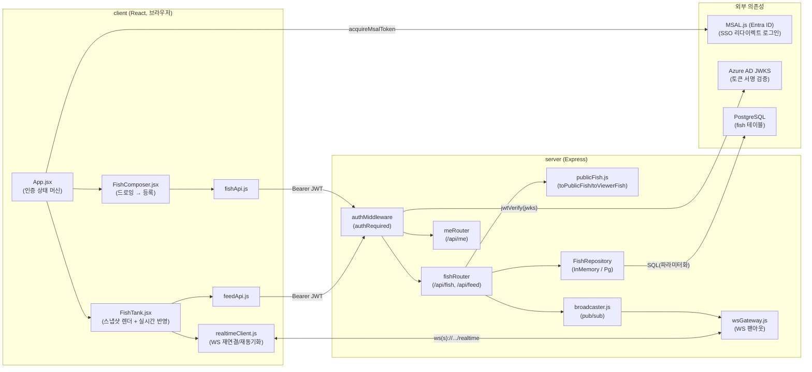
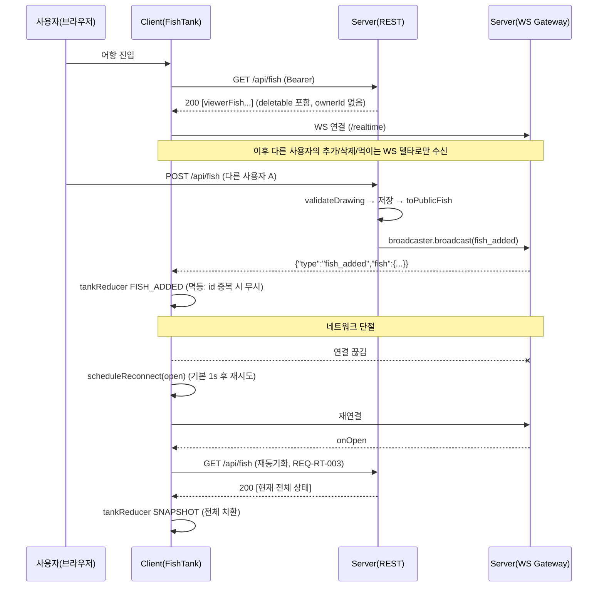
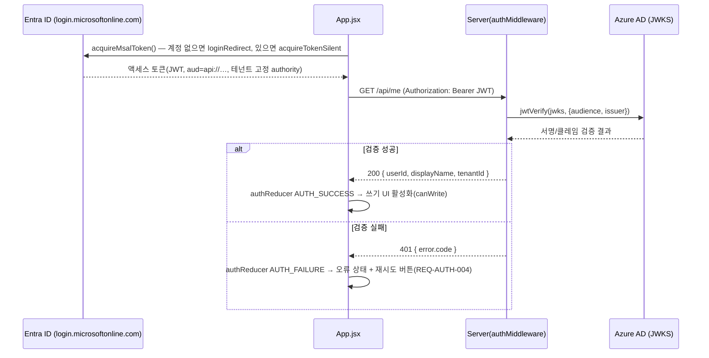

# 아키텍처 개요 (랜선어항)

SPEC: `.moai/specs/SPEC-TANK-001/spec.md` · 상세 API 형식: `docs/api.md`

## 1. 전체 구조

```
fish-tank/
  client/   React 18 + Vite — Microsoft SSO(MSAL) 로그인, 드로잉/어항 렌더링
  server/   Node.js + Express — SSO 토큰 검증, 물고기 CRUD, 실시간 브로드캐스트
```

npm workspaces 로 두 패키지를 하나의 저장소에서 관리합니다(`package.json` 루트 `workspaces: ["client", "server"]`).



## 2. 계층 구조 (Client)

| 모듈 | 책임 |
|---|---|
| `src/App.jsx` | 앱 셸. `authMachine` 상태(`idle→authenticating→authenticated/error`)에 따라 UI 전환, 인증 실패 시 재시도 버튼 노출(REQ-AUTH-004) |
| `src/auth/msalAuth.js` | MSAL.js 리다이렉트 로그인으로 액세스 토큰 획득(`acquireMsalToken`), 테넌트 고정 authority |
| `src/auth/authMachine.js` | 순수 리듀서. `canWrite(state)` 로 쓰기 UI 활성화 여부 판정 |
| `src/drawing/DrawingCanvas.jsx`, `drawingModel.js` | 자유 드로잉 캔버스(undo/clear), 스트로크 직렬화 |
| `src/fish/FishComposer.jsx`, `fishApi.js` | 이름/익명 선택 등록 UI, `POST /api/fish` 호출 |
| `src/tank/FishTank.jsx` | 어항 렌더링(스냅샷 로드 + WS 델타 반영), 클릭/호버 정보 패널(`fishInfo.js`) |
| `src/tank/tankModel.js` | 스프라이트 물리(속도/경계), `MAX_ANIMATED`(200) 상한으로 다수 물고기 렌더링 성능 보호(NFR-PERF-001) |
| `src/tank/tankReducer.js` | `SNAPSHOT`(전체 치환) / `FISH_ADDED`(멱등) / `FISH_DELETED` 순수 리듀서 |
| `src/tank/realtimeClient.js` | WebSocket 연결 추상화, 끊김 시 자동 재연결 예약, 재연결 시 `onOpen` 콜백으로 재동기화 트리거(REQ-RT-003) |
| `src/tank/feedApi.js`, `feedingModel.js` | 먹이주기 요청 및 반응 애니메이션 |
| `src/theme/colors.js`, `contrast.js` | WCAG 2.1 AA 색 대비 토큰 및 대비 계산 검증 |

## 3. 계층 구조 (Server)

| 모듈 | 책임 |
|---|---|
| `src/app.js` | Express 앱 조립. `/healthz` 는 공개, `/api/*` 는 `authRequired` 통과 후 `meRouter`/`fishRouter` 위임 |
| `src/server.js` | 프로덕션 진입점. env → verifier/DB pool/broadcaster 구성, HTTP 서버 위에 `WebSocketServer`(`/realtime`) 부착 |
| `src/auth/verifyTeamsToken.js` | `jose.jwtVerify` 로 JWT 검증, jose 오류를 도메인 `AuthError` 코드로 매핑 |
| `src/auth/authConfig.js` | env(`TEAMS_TENANT_ID`, `TEAMS_APP_CLIENT_ID` 등)에서 issuer/audience/JWKS 유도, `createRemoteJWKSet` 검증기 생성 |
| `src/auth/authMiddleware.js` | `Authorization: Bearer` 추출 → 검증 → `req.user` 설정. 모든 보호 라우트의 진입 관문 |
| `src/routes/fish.js` | 물고기 생성/조회/삭제, 먹이주기 라우트. 검증·투영·저장·브로드캐스트가 모이는 경계 |
| `src/fish/validateDrawing.js` | 그림 데이터 형식/크기/최소성 검증(서버가 최종 권한, NFR-SEC-003) |
| `src/fish/publicFish.js` | `toPublicFish`(ownerId 제거) / `toViewerFish`(+ `deletable` 계산). 모든 읽기 응답이 반드시 통과하는 투영 경계(REQ-OWN-004) |
| `src/fish/fishRepository.js`, `pgFishRepository.js` | 저장소 계약(`create/list/findById/delete`)과 두 구현(인메모리·PostgreSQL) |
| `src/realtime/broadcaster.js` | 인메모리 pub/sub. `fishAddedEvent`/`fishDeletedEvent`/`foodDroppedEvent` 팩토리 |
| `src/realtime/wsGateway.js` | 브로드캐스터 이벤트를 열린 WebSocket 클라이언트로 팬아웃(`attachRealtime`) |
| `src/db/pool.js` | `DATABASE_URL` 로만 PostgreSQL 연결 풀 생성(자격증명 하드코딩 금지) |
| `migrations/001_create_fish.sql` | `fish` 테이블(`id, drawing JSONB, owner_id, display_mode, display_name, created_at`) + 소유자/생성시각 인덱스 |

## 4. 실시간 모델: 스냅샷 + 델타 + 재연결

REQ-RT-001~004, REQ-RT-003을 만족시키는 핵심 패턴은 **"진입 시 전체 스냅샷 로드 → 이후 델타만 실시간 수신 → 재연결 시 스냅샷 재로드로 재동기화"** 입니다.



- 클라이언트 리듀서(`tankReducer.js`)는 `SNAPSHOT` 을 전체 치환, `FISH_ADDED` 를 멱등(이미 있는 id 는 무시)으로 처리해 스냅샷 로드와 델타 수신이 경합해도 안전합니다.
- WebSocket 연결 자체는 별도 인증이 없습니다. 모든 신원/소유권 검증은 REST 쓰기 경로에서 서버가 수행하고, WS는 이미 검증·공개 투영된 이벤트만 팬아웃합니다.
- 렌더링 성능(NFR-PERF-001): 물고기가 수백 마리 이상이어도 `tankModel.js` 의 `selectAnimated()` 가 동시 애니메이션 대상을 `MAX_ANIMATED`(200)로 제한하고, 상한을 넘는 물고기는 정지 렌더로 표시합니다.

## 5. 영속성 / 저장소 추상화

`FishRepository` 계약(`create/list/findById/delete`)을 두 구현이 만족합니다:

- `InMemoryFishRepository` — 테스트·로컬 개발용. 라이브 DB 없이 동작.
- `PgFishRepository` — 프로덕션용. 모든 값을 파라미터화 쿼리로 전달(SQL 인젝션 방지, NFR-SEC-003). DB 행(snake_case)을 내부 레코드(camelCase)로 매핑.

`server.js` 는 프로덕션 진입점에서만 `PgFishRepository`(+ `createPoolFromEnv`)를 주입하고, 테스트는 `createApp({ verify, fishRepository, broadcaster })` 에 인메모리 구현을 주입해 라이브 DB/소켓 없이 라우트를 검증합니다.

## 6. 보안 경계: 익명 소유권 (REQ-OWN-001~004, NFR-SEC-001/002)

이 프로젝트의 핵심 보안 불변식은 **"내부 소유권 추적과 화면 노출은 완전히 분리된다"** 입니다.

- **저장 시**: 익명 물고기도 예외 없이 `ownerId`(검증된 토큰의 `oid` 클레임)를 내부적으로 저장합니다(REQ-OWN-001). `displayMode: "anonymous"` 이면 `displayName` 은 저장 단계에서부터 `null` 로 고정됩니다.
- **읽기 시**: 모든 물고기 읽기 경로(`GET /api/fish` 응답, WS `fish_added` 이벤트)는 `publicFish.js` 의 투영 함수를 반드시 통과합니다.
  - `toPublicFish` — `ownerId` 를 완전히 제거한 공개 형식. WS 브로드캐스트가 사용(전 사용자 공용이므로 개인화 필드가 없어야 함).
  - `toViewerFish` — `toPublicFish` 위에 요청자 기준 `deletable`(불리언) 만 추가. `deletable` 계산에는 내부 `ownerId` 를 사용하지만, **그 값 자체는 응답에 절대 포함되지 않습니다**. `GET /api/fish` 스냅샷 응답이 사용(사용자별로 삭제 가능 여부가 달라야 하므로 REST 경로에만 존재하고 WS 이벤트에는 없음).
- **삭제 시**: `DELETE /api/fish/:id` 는 클라이언트가 보낸 어떤 소유자 주장도 무시하고, 저장된 내부 `ownerId` 와 **서버가 검증한 토큰의 `req.user.userId`** 만 비교합니다(NFR-SEC-002). 타인 물고기 삭제 시도는 403, 대상 없음은 404 — 두 경우 모두 실제 소유자 신원을 노출하지 않습니다.
- **먹이주기**: 좌표만 브로드캐스트하며 호출자 신원은 이벤트에 포함하지 않습니다. 먹이는 저장되지 않는 임시 효과이므로 소유권 레코드 자체가 없습니다.

이 경계는 `server/src/fish/publicFish.js`, `server/src/routes/fish.js` 의 `@MX:ANCHOR` 주석에 명시되어 있으며, 관련 유닛 테스트(`publicFish.test.js`, `fish.test.js`)가 익명 신원 비노출과 소유권 검증을 각각 증명합니다.

## 7. 인증 흐름 (Microsoft SSO — MSAL 리다이렉트)



토큰은 이후 `POST /api/fish`, `DELETE /api/fish/:id`, `POST /api/feed` 호출 시에도 동일하게 `Authorization: Bearer` 로 재사용됩니다. 클라이언트는 인증되지 않은 동안(`idle`/`authenticating`/`error`) 그리기·삭제·먹이주기 UI를 비활성화합니다(`canWrite`).

## 8. 접근성 (NFR-A11Y-001)

캔버스(드로잉/어항)는 포인터 전용이라 키보드로 직접 조작할 수 없으므로, 주요 액션(undo/clear/제출, 이름·익명 선택, 먹이주기, 물고기 선택·정보 조회, 본인 물고기 삭제, 인증 재시도)은 네이티브 버튼/라디오로 별도 제공되어 키보드 대체 경로를 갖습니다. 인증 오류는 `role="alert"`, 먹이 안내·정보 패널은 `role="status"` 라이브 영역으로 노출됩니다. 색 대비 토큰은 `client/src/theme/colors.js`/`contrast.js` 로 관리되며 WCAG 2.1 AA(4.5:1) 충족을 테스트로 검증합니다(사용자가 그린 캔버스 그림 자체는 대비 기준 예외). 자세한 내용은 `README.md` "접근성" 절 참조.

## 9. 참고

- SPEC/계획/인수기준: `.moai/specs/SPEC-TANK-001/{spec,plan,acceptance}.md`
- API 상세: `docs/api.md`
- 환경 변수: `.env.example`
